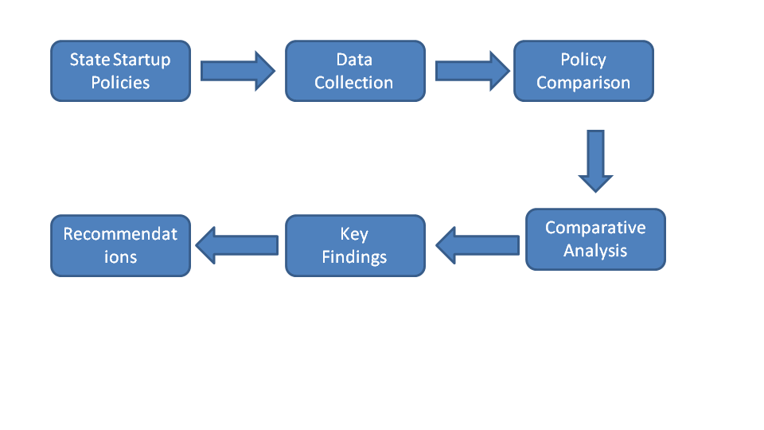
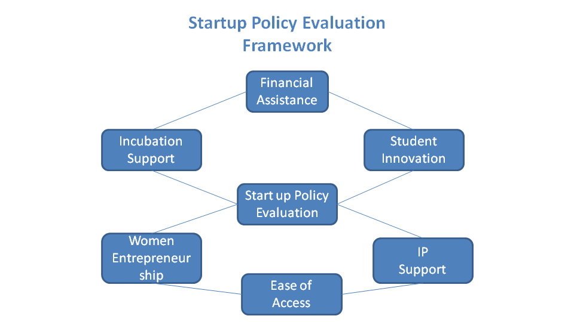

# Startup Policy Analysis India

## Comparative Analysis of Startup Policies Across Selected Indian States

This repository contains an independent research report that presents a comparative analysis of startup policies across selected Indian states. The study evaluates government initiatives supporting entrepreneurship through financial assistance, incubation infrastructure, innovation ecosystems, student entrepreneurship, intellectual property support, and women entrepreneurship.

The objective is to understand how different state governments design startup ecosystems and identify policy strengths, common practices, and opportunities for improvement.

---

## Research Methodology



---

## Policy Evaluation Framework



---

## Research Scope


---

## Objectives

- Compare startup policies across selected Indian states.
- Analyse financial support mechanisms.
- Study incubation and innovation ecosystems.
- Evaluate women entrepreneurship initiatives.
- Compare student startup support.
- Examine intellectual property support.
- Identify policy gaps and best practices.

---

## States Analysed

- Gujarat
- Karnataka
- Tamil Nadu
- Telangana

---

## Repository Structure

```
startup-policy-analysis-India/
│
├── README.md
├── Comparative_Analysis_of_Startup_Policies_Across_Selected_Indian_States.pdf
├── LICENSE
├── .gitignore
│
├── images/
│   ├── 01_research_methodology.png
│   ├── 02_policy_evaluation_framework.png
│   └── 03_research_scope.png
│
└── references/
    └── sources.md
```

---

## Future Work

Possible extensions include:

- Startup ecosystem benchmarking
- Venture capital trend analysis
- Startup funding data analytics
- Incubator performance comparison
- Policy effectiveness measurement

---

## Author

**Mehak Rai**

Independent Research Project
